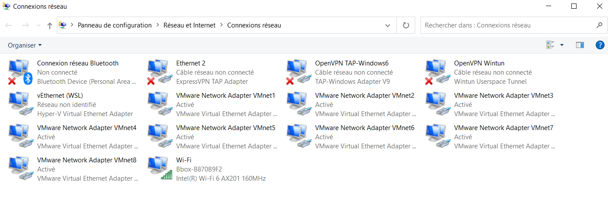
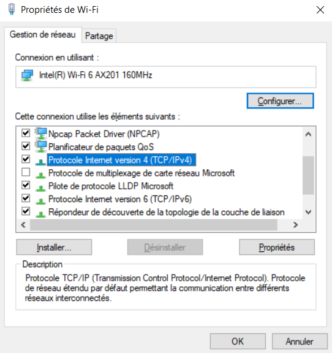
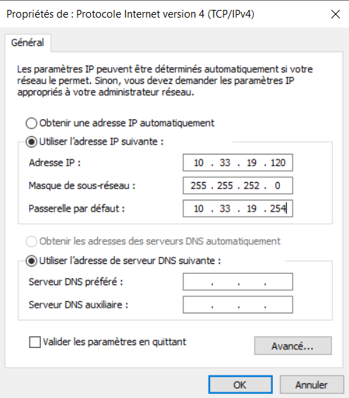
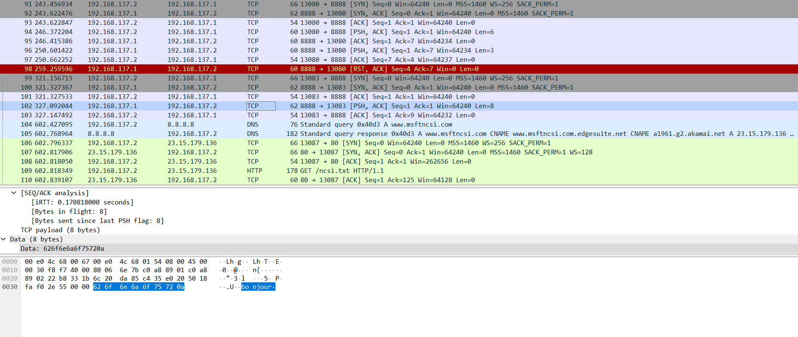
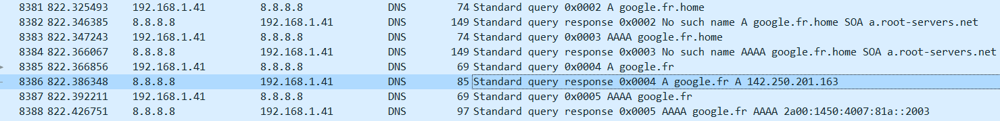

# TP réseau 1
**Important** : L'OS de ma machine est Windows
## I. Exploration locale en solo

### 1. Affichage d'information sur la pile TCP/IP locale
 - Interface Wifi :  
 Commande utilisé : 
 ```bash
 ipconfig /all
 ```
 ```bash
 Carte réseau sans fil Wi-Fi :

   Suffixe DNS propre à la connexion. . . :  
   Description. . . . . . . . . . . . . . : Intel(R) Wi-Fi 6 AX201 160MHz
   Adresse physique . . . . . . . . . . . : 18-CC-18-FC-31-F9
   DHCP activé. . . . . . . . . . . . . . : Oui
   Configuration automatique activée. . . : Oui
   Adresse IPv6 de liaison locale. . . . .: fe80::cc1d:a46e:401d:35a4%31(préféré)
   Adresse IPv4. . . . . . . . . . . . . .: 10.33.19.104(préféré)
   Masque de sous-réseau. . . . . . . . . : 255.255.252.0
   Bail obtenu. . . . . . . . . . . . . . : mercredi 28 septembre 2022 14:51:38
   Bail expirant. . . . . . . . . . . . . : jeudi 29 septembre 2022 14:51:40
   Passerelle par défaut. . . . . . . . . : 10.33.19.254  
   Serveur DHCP . . . . . . . . . . . . . : 10.33.19.254
   IAID DHCPv6 . . . . . . . . . . . : 169397272
   DUID de client DHCPv6. . . . . . . . : 00-01-00-01-28-CA-F1-2E-18-CC-18-FC-31-F9
   Serveurs DNS. . .  . . . . . . . . . . : 8.8.8.8
                                          8.8.4.4  
                                          1.1.1.1
   NetBIOS sur Tcpip. . . . . . . . . . . : Activé
   ```
   - nom 
   ```bash
   Description. . . . . . . . . . . . . . : Intel(R) Wi-Fi 6 AX201 160MHz
   ```
   - adresse MAC
   ```bash
   Adresse physique . . . . . . . . . . . : 18-CC-18-FC-31-F9
   ```
   - adresse IP
   ```bash
   Adresse IPv4. . . . . . . . . . . . . .: 10.33.19.104(préféré)
   ```
 - Interface Ethernet :  
 Commande utilisé :  
 ```bash
 ipconfig /all 
 ```
 
 ```bash
 Carte Ethernet Ethernet 2 :

   Statut du média. . . . . . . . . . . . : Média déconnecté
   Suffixe DNS propre à la connexion. . . :
   Description. . . . . . . . . . . . . . : ExpressVPN TAP Adapter
   Adresse physique . . . . . . . . . . . : 00-FF-CB-D9-E6-E9
   DHCP activé. . . . . . . . . . . . . . : Oui
   Configuration automatique activée. . . : Oui
 ```
 
   - nom  
   ```bash
   Description. . . . . . . . . . . . . . : ExpressVPN TAP Adapter
   ```
   - adresse MAC
   ```bash
    Adresse physique . . . . . . . . . . . : 00-FF-CB-D9-E6-E9
  ```
   - adresse IP  
   Je n'ai pas de branchement Ethernet sur mon PC donc je n'ai pas pu me connecter à un réseau
 - Gateway de la carte Wifi:  
 Commande utilisé : 
 ```bash
 ipconfig /all
 ```

 ```bash
 Carte réseau sans fil Wi-Fi :

   Suffixe DNS propre à la connexion. . . :  
   Description. . . . . . . . . . . . . . : Intel(R) Wi-Fi 6 AX201 160MHz
   Adresse physique . . . . . . . . . . . : 18-CC-18-FC-31-F9
   DHCP activé. . . . . . . . . . . . . . : Oui
   Configuration automatique activée. . . : Oui
   Adresse IPv6 de liaison locale. . . . .: fe80::cc1d:a46e:401d:35a4%31(préféré)
   Adresse IPv4. . . . . . . . . . . . . .: 10.33.19.104(préféré)
   Masque de sous-réseau. . . . . . . . . : 255.255.252.0
   Bail obtenu. . . . . . . . . . . . . . : mercredi 28 septembre 2022 14:51:38
   Bail expirant. . . . . . . . . . . . . : jeudi 29 septembre 2022 14:51:40
   Passerelle par défaut. . . . . . . . . : 10.33.19.254  
   Serveur DHCP . . . . . . . . . . . . . : 10.33.19.254
   IAID DHCPv6 . . . . . . . . . . . : 169397272
   DUID de client DHCPv6. . . . . . . . : 00-01-00-01-28-CA-F1-2E-18-CC-18-FC-31-F9
   Serveurs DNS. . .  . . . . . . . . . . : 8.8.8.8
                                          8.8.4.4  
                                          1.1.1.1
   NetBIOS sur Tcpip. . . . . . . . . . . : Activé
   ```
 Réponse :
 ```bash
 Passerelle par défaut. . . . . . . . . : 10.33.19.254
 ```

### 2. Modificiation des informations :
 - Utilisation de l'interface graphique pour changer son adresse IP :  
   - Paramètre -> Réseau et Internet -> Modifier les options d'adaptateur   
   (nous montre les différentes cartes réseau de notre appareil)
   
   - Double clique sur le Wifi -> Propriété -> Protocole Internet version 4 (TCP/IPv4)
   
   - Configuration nouvelle IP
   

  - Pourquoi on peut perdre Internet ?

  On peut perdre internet car si l'on choisi une IP déjà prise par une autre machine du Réseau, alors les réponses aux requêtes qu'on effectuera seront reçu par la machine possédant l'IP en premier, donc pas par nous.


## II. Exploration locale en duo

Cette partie a été fais avec **Raphael MENARD**
### 3. Modification d'adresse IP
```bash
ipconfig /all

Carte Ethernet Ethernet :

   Adresse IPv6 de liaison locale. . . . .: fe80::3056:5918:de36:d2bb%59(préféré)
   Adresse IPv4. . . . . . . . . . . . . .: 192.168.0.1(préféré)
   Masque de sous-réseau. . . . . . . . . : 255.255.255.252
```
La machine A prends l'IP 192.168.0.1 , la machine B prends l'IP 192.168.0.2 
```bash
ping 192.168.0.2

Envoi d’une requête 'Ping'  192.168.0.2 avec 32 octets de données :
Réponse de 192.168.0.2 : octets=32 temps<1ms TTL=128
Réponse de 192.168.0.2 : octets=32 temps<1ms TTL=128
Réponse de 192.168.0.2 : octets=32 temps=1 ms TTL=128
Réponse de 192.168.0.2 : octets=32 temps=1 ms TTL=128

Statistiques Ping pour 192.168.0.2:
    Paquets : envoyés = 4, reçus = 4, perdus = 0 (perte 0%),
Durée approximative des boucles en millisecondes :
    Minimum = 0ms, Maximum = 1ms, Moyenne = 0ms
```
Le ping de la machine A vers B fonctionne
```bash
arp -a

Interface : 192.168.0.1 --- 0x3b
  Adresse Internet      Adresse physique      Type
  192.168.0.2           00-e0-4c-68-00-67     dynamique
  192.168.0.3           ff-ff-ff-ff-ff-ff     statique
  224.0.0.22            01-00-5e-00-00-16     statique
  224.0.0.251           01-00-5e-00-00-fb     statique
  224.0.0.252           01-00-5e-00-00-fc     statique
  239.255.255.250       01-00-5e-7f-ff-fa     statique
  255.255.255.255       ff-ff-ff-ff-ff-ff     statique
```

```bash
Adresse Internet      Adresse physique      Type
  192.168.0.2           00-e0-4c-68-00-67     
```
On peut voir l'IP de la machine B qui, suite au ping, est associé à l'adresse MAC de la carte réseau Ethernet

### 4. Utilisation d'un des deux comme gateway
On a mis en mode avion la machine B et suivis les étapes necessaire pour configurer la machine A afin que B puisse se servir de A pour "avoir internet".  
Ce qui à fais changer l'IP de A pour 192.168.137.1  
**La commande suivante a été effectué sur la machine B**
```bash
tracert 8.8.8.8

Détermination de l’itinéraire vers 8.8.8.8 avec un maximum de 30 sauts.

  1    <1 ms     *        1 ms  DESKTOP-JA0JAN6 [192.168.137.1]
  2     *        *        *     Délai d’attente de la demande dépassé.
  3     8 ms     6 ms     6 ms  10.33.19.254
  4    12 ms    11 ms     6 ms  77.196.149.137
  5    12 ms    11 ms    11 ms  212.30.97.108
  6    24 ms    23 ms    23 ms  77.136.172.222
  7    24 ms    22 ms    21 ms  77.136.172.221
  8    33 ms    48 ms    30 ms  194.6.144.186
  9    33 ms    25 ms    23 ms  194.6.144.186
 10    24 ms    24 ms    25 ms  72.14.194.30
 11    26 ms    26 ms    24 ms  172.253.69.49
 12    24 ms    24 ms    25 ms  108.170.238.107
 13    24 ms    25 ms    24 ms  8.8.8.8

Itinéraire déterminé.
```
On peut voir que la première étape est la machine A suivis ensuite de la passerelle du réseau YNOV (10.33.19.254) ce qui vérifie bien le petit schéma ASCII de l'énoncé et permet de donner un accès internet à la machine B.  
### 5. Petit chat privé

Voici la commande pour le côté serveur (machine B) afin de le faire écouter sur le port 8888
```bash
.\nc.exe -l -p 8888
```

Ici pour le côté client (machine A) pour débuter une connection avec la machine B (IP : 192.168.137.2) sur le port 8888
```bash
.\nc.exe 192.168.137.2 8888
Bonjour, Moi c'est Raphaël Menard le client de la B2B eleve à l'ecole ynov
Salut ! Moi c'est Fabien GARCIA le serveur :D
Enchanté Fabien GARCIA le serveur !!!
```

La commande suivante permet d'écouter sur l'IP 192.168.137.2 (toujours sur le port 8888), c'est à dire qu'on écoute seulement les connexions provenant du réseau composé de nos machine A et B.
```bash
.\nc.exe -l -p 8888 -s 192.168.137.2
```


### 6. Firewall
```bash
netsh advfirewall firewall add rule name="ICMP Allow incoming V4 echo request" protocol=icmpv4:8,any dir=in action=allow
```
Cette commande permet d'ajouter une règle "ICMP Allow incoming V4 echo request" autorisant les paquets ICMP de type 8 entrant


```bash
ping 10.33.19.104

Envoi d’une requête 'Ping'  10.33.19.104 avec 32 octets de données :
Réponse de 10.33.19.104 : octets=32 temps=4 ms TTL=128
Réponse de 10.33.19.104 : octets=32 temps=5 ms TTL=128
Réponse de 10.33.19.104 : octets=32 temps=30 ms TTL=128
Réponse de 10.33.19.104 : octets=32 temps=31 ms TTL=128

Statistiques Ping pour 10.33.19.104:
    Paquets : envoyés = 4, reçus = 4, perdus = 0 (perte 0%),
Durée approximative des boucles en millisecondes :
    Minimum = 4ms, Maximum = 31ms, Moyenne = 17ms
```


```bash
netsh advfirewall firewall add rule name= "Open Port 8888" dir=in action=allow protocol=TCP localport=8888
```

Cette commande permet d'ajouter une règle "Open Port 8888" autorisant les connexions TCP entrante sur le port 8888

```bash
.\nc.exe -l -p 8888
bonjour
```
Même avec le pare-feu d'activer on peut quand même ping et discuter

## III. Manipulation d'autres outils/protocoles côté client

### 1. DHCP
 Commande utilisé pour récupérer les informations : 
 ```bash
 ipconfig /all
 ```
   - IP du serveur DHCP du réseau wifi d'YNOV
   ```bash
   Serveur DHCP . . . . . . . . . . . . . : 10.33.19.254
   ```
   - Date d'expiration du bail DHCP
   ```bash
   Bail expirant. . . . . . . . . . . . . : jeudi 29 septembre 2022 14:51:40
   ```

### 2. DNS  
J'effectue actuellement cette partie depuis chez moi, les serveurs DNS connu de mon PC sont les suivants :
```bash
Serveurs DNS. . .  . . . . . . . . . . : 2001:861:c5:740:8ec5:b4ff:fe33:b8e5
                                       192.168.1.254
                                       2001:861:c5:740:8ec5:b4ff:fe33:b8e5
```
#### **Lookup**  
 - Première commande :
```bash
 nslookup google.com 
```
```bash
DNS request timed out.
    timeout was 2 seconds.
Serveur :   UnKnown
Address:  2001:861:c5:740:8ec5:b4ff:fe33:b8e5

Réponse ne faisant pas autorité :
Nom :    google.com
Addresses:  2a00:1450:4007:80d::200e
          142.250.75.238
```
 - Seconde commande :
 ```bash
 nslookup -recurse 78.74.21.21
 ```
 ```bash
 DNS request timed out.
    timeout was 2 seconds.
Serveur :   UnKnown
Address:  2001:861:c5:740:8ec5:b4ff:fe33:b8e5

Réponse ne faisant pas autorité :
Nom :    ynov.com
Addresses:  2606:4700:20::ac43:4ae2
          2606:4700:20::681a:ae9
          2606:4700:20::681a:be9
          104.26.10.233
          172.67.74.226
          104.26.11.233
```

- Interprétation :  

Dans les 2 commandes on remarque que le serveur DNS utilisé est le même (2001:861:c5:740:8ec5:b4ff:fe33:b8e5).  
En résultat pour "google.com" on obtient 1 IPv4 (142.250.75.238) et 1 IPv6 (2a00:1450:4007:80d::200e) qui sont donc associé à google.com
Pour "ynov.com" la on obtient 3 IPv4 et 3 IPv6 associé à ynov.com.
#### **reverse lookup**  

- Première commande :
```bash
 nslookup -recure 78.74.21.21 
```
```bash
DNS request timed out.
    timeout was 2 seconds.
Serveur :   UnKnown
Address:  2001:861:c5:740:8ec5:b4ff:fe33:b8e5

Nom :    host-78-74-21-21.homerun.telia.com
Address:  78.74.21.21
```
- Seconde commande :
```bash
 nslookup -recure 92.146.54.88 
```
```bash
Serveur :   UnKnown
Address:  2001:861:c5:740:8ec5:b4ff:fe33:b8e5

*** UnKnown ne parvient pas à trouver 92.146.54.88 : Non-existent domain
```
- Interprétation :  

Une nouvelle fois dans les 2 cas, on utilise le même serveur DNS (2001:861:c5:740:8ec5:b4ff:fe33:b8e5)  
Pour la première commande on voit que l'IP 78.74.21.21 est associé à "host-78-74-21-21.homerun.telia.com"  
En revanche pour la seconde commande, l'IP 92.146.54.88 ne semble être associé à personne (En tout cas le serveur DNS utilisé n'en a pas connaissance)


## IV. Wireshark
**Manipulation effectué depuis chez moi**  
Mon IP est : 192.168.1.41  
Ma passerelle : 192.168.1.254

 - Ping   
 Commande :
  ```bash
 ping 192.168.1.254
 ```
 

 - Netcat  

 **Capture effectué en cours, pendant la partie "Petit chat privé"**
  

  Ici on voit les trames de notre connection via Netcat (sauf les trames vertes et les 2 trames DNS)  
  On peut observer que la trame selectionné contient de la Data qui se trouve être un message : "bonjour"

 - Requête DNS
 Commande effectué :
 ```bash
 nslookup.exe google.fr 8.8.8.8
 ```
 Afin de forcer l'utilisation du serveur DNS 8.8.8.8  

  

On observe ici les échanges entre ma machine et le serveur DNS 8.8.8.8  
Les 2 premiers échange ne sont pas positif car il effectue une requête sur google.fr.home (la présence du .home est surement du a 
```bash
Suffixe DNS propre à la connexion. . . : home
```
 présent dans les paramètre de la carte Wifi)  
 Puis ensuite les 2 échanges suivants sont bien sur "google.fr"  
 On remarque aussi qu'il y a une première requête pour obtenir l'IPv4 puis ensuite une nouvelle requête pour obtenir l'IPv6
